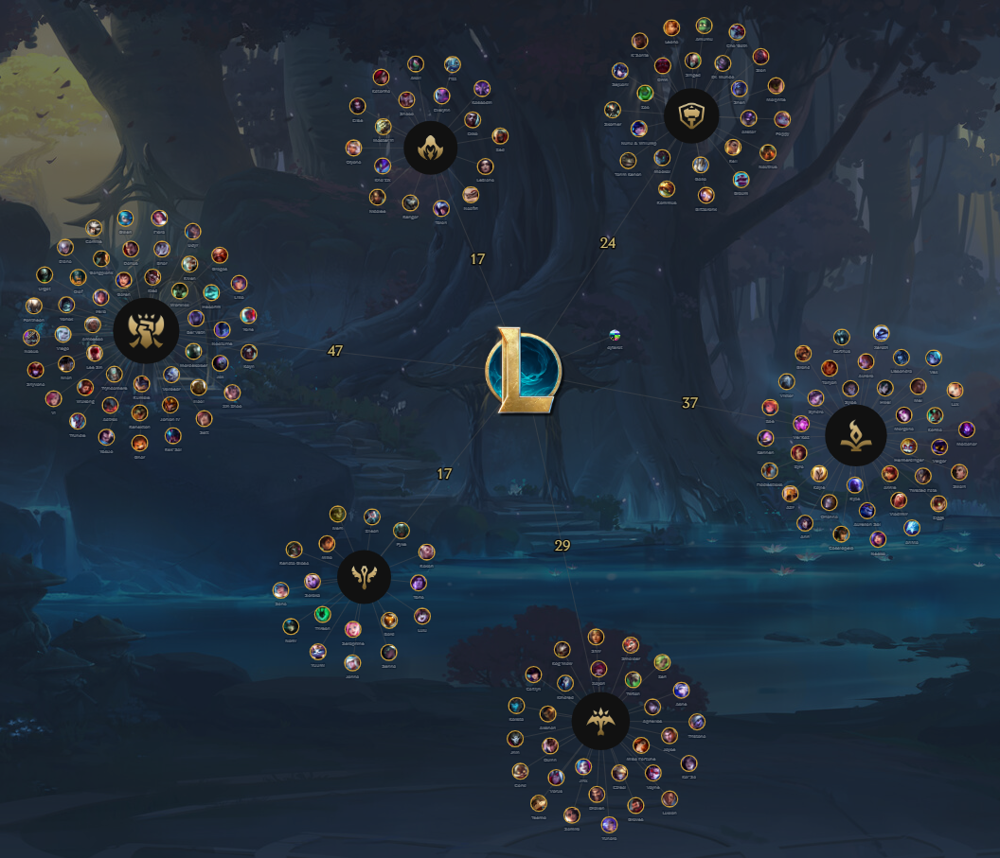
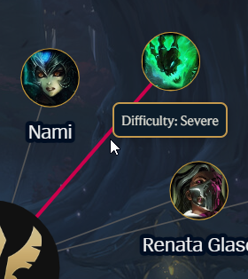
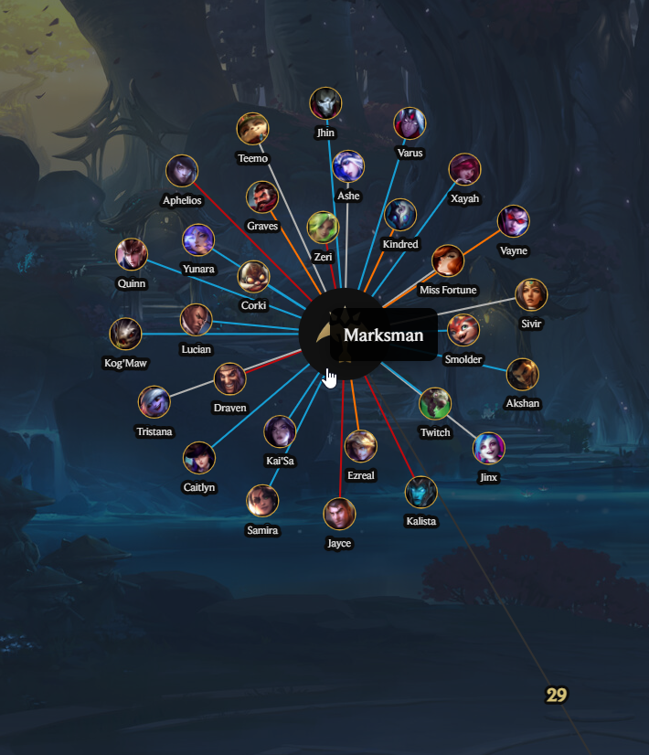
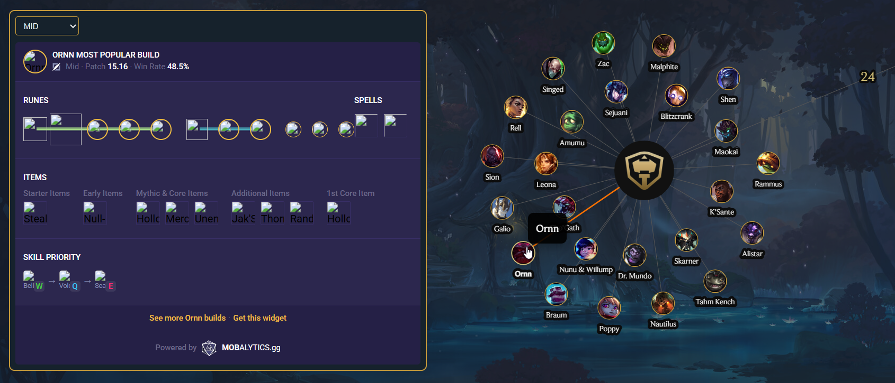
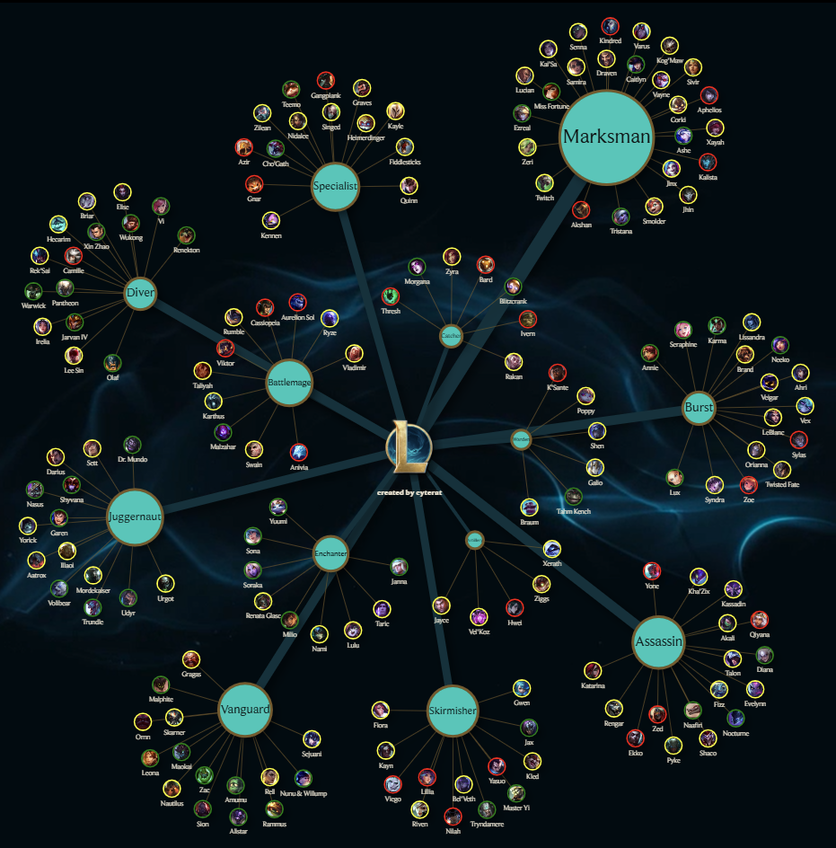
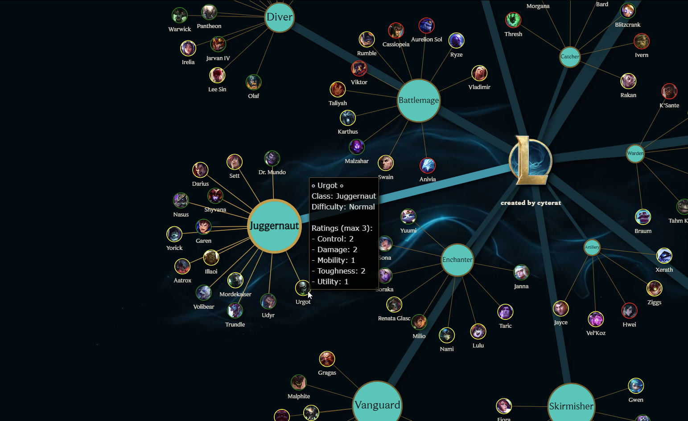

# 🎮 League of Legends Champions and Classes Network Visualization

[League of Legends Champions Network](https://lol-champions-network-2baea.ondigitalocean.app/)

This project visualizes the relationships between League of Legends champions and their respective classes. The visualization is created using __vis.js__, with nodes representing various League of Legends entities, currenlty champions and classes, and edges representing the relationships between them.

The implementation focuses on smooth user experience with behind-the-scenes optimizations to handle large amounts of champion data and images efficiently.

## User Features

### Visual Interactions:

- Zoom & Pan: Smooth zooming and panning to explore different areas of the network

- Click/Hover Effects: Edges highlight with different colors when you click/hover over them providing additional information.

    <table><tr><td></td><td></td></tr></table>

- Champion Widget __(CURRENTLY DOES NOT WORK PROPERLY, trying to reslove [issue #2](https://github.com/cyterat/lol-champs-network/issues/2))__: Click on any node to view interactive build recommendations for different roles (TOP, JUNGLE, MID, ADC, SUPPORT)

    

## Technical Implementation

### Performance Optimizations:

- Progressive Image Loading: Images load in small batches to prevent freezing during startup
- Memory-Safe DataViews: Uses vis.js DataViews to efficiently filter large datasets without duplicating data
- Fallback Images: Automatic fallback to default images when champion portraits fail to load
- Batch Processing: Loads images in groups of 5 with small delays between batches

### Network Features:

- Dynamic Filtering: Switch between different relationship types (implemented with DataView filtering)
- Auto-Fitting: Network automatically adjusts view to show filtered content
- Loading Indicators: Visual feedback during view transitions
- Error Handling: Graceful handling of missing data or failed image loads

## Hosting

The graph visualization is hosted on Digital Ocean.

## Motivation

This project was created for fun to visualize the distributions and relationships between different entities in League of Legends.

## Sources

- **Colors, logo, font:** [Riot Games](https://brand.riotgames.com/en-us/league-of-legends/fundamentals)

- **Data, champion icons, colors:** [Mobalytics](https://mobalytics.gg/lol)

- **Champion builds widget:** [Mobalytics](https://github.com/mobalyticshq/mobalytics-widgets)

- **Page background image:** [Muzli Search](https://search.muz.li/OGExNmFiZWVj)

- **Data, icons:** [League of Legends Wiki](https://leagueoflegends.fandom.com/wiki/League_of_Legends_Wiki)

## Previous implementation

Not class based.

<table><tr><td></td><td></td></tr></table>

## Important Notice - 2025 Rework

- The first version of the project was built using python NetworkX and PyVis libraries. It had extremely poor performance and messed up html and javascript, as it was 'generated' through python libraries. That's why I decided to completely rework it, using cleaner approach and app structure, i.e. HTML/CSS/Javascript only.

- The entire "data" side of project was done by me using Python (requests, BeautifulSoup) for scraping, cleansing, aggregation, and conversion to the appropriate format. Currenlty it still sits in the Jupyter Notebook, waiting to be refactored into a separate script that will potentially have a scheduled run.

- 99% of the JavasScript code has been generated through prompts by Gemini > Claude > Chat GPT (in that order), with 1% of minor tweaks from my side. 

## To Do

- ~~Python generated visualization will be replaced with html/js/css trio.~~
- Several views (network combinations) will be implemented.
- Additional League of Legends entities will be added.
- Scheduled script written in Python, for data manipulations, will be implemented. 
