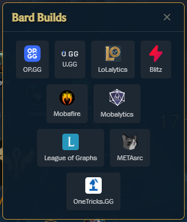

# League of Legends Champions and Classes Network Visualization

 

🔥 [League of Legends Champions Network](https://lol-champion-builds-d6r5z.ondigitalocean.app/) 🔥

A web-based tool for exploring current League of Legends champions and their builds, powered by vis.js

Clicking on a champion node reveals a dynamic popup with links to various external build guides.

## 🌟Motivation

As a passion project, I wanted to combine my interest in network/graph data visualization with some experience in playing League of Legends. The primary motivation was to explore how different champions connect and to build an interactive experience from the ground up. The added functionality of providing a central place for popular builds was a natural extension of that goal, making the project a useful single-source hub for finding popular champion builds.

## 💎 User Features

<table><tr><td><b>Champion Builds</b> Clicking on any champion node opens a pop-up panel with dynamically generated links to popular build sites, providing builds for the selected champion.</td><td></td></tr></table>

<table><tr><td><b>Click/Hover Effects</b> Nodes and Connections react visually when clicked or hovered over, providing additional information.</td><td></td><td></td></tr></table>

## 🔨 Technical Implementation

### Performance Optimizations:

- Progressive Image Loading: Images load in small batches to prevent freezing during startup
- Fallback Images: Automatic fallback to default images when champion portraits fail to load
- Batch Processing: Loads images in groups of 5 with small delays between batches

## 📦 Hosting

The graph visualization is hosted on Digital Ocean.

## 🧲 Sources

- **Colors, logo, font:** [Riot Games](https://brand.riotgames.com/en-us/league-of-legends/fundamentals)

- **Champion data:** [Riot's Data Dragon](https://developer.riotgames.com/docs/lol) 

- **Champion difficulty levels:** [Mobalytics](https://mobalytics.gg/lol)

- **Page background image:** [Muzli Search](https://search.muz.li/OGExNmFiZWVj)

- **Other data, icons:** [League of Legends Wiki](https://leagueoflegends.fandom.com/wiki/League_of_Legends_Wiki)

## 🚧 Previous implementation

<table><tr><td></td><td></td></tr></table>

## 💡 Important Notice - 2025 Rework

- The first version of the project was built using python NetworkX and PyVis libraries. It had extremely poor performance and messed up html and javascript, as it was 'generated' through python libraries. That's why I decided to completely rework it, using cleaner approach and app structure, i.e. HTML/CSS/Javascript only.

- The entire "data" side of project was done by me using Python (requests, BeautifulSoup) for scraping, cleansing, aggregation, and conversion to the appropriate format. Currenlty it still sits in the Jupyter Notebook, waiting to be refactored into a separate script that will potentially have a scheduled run.

- 99% of the JavasScript code has been generated through prompts by Gemini > Claude > Chat GPT (in that order), with 1% of minor tweaks from my side. 

- I had been trying to set up Mobalytics widget with champion builds, on node select, for a long time. However due to unresolved CORS errors related to dynamically generated elements, I decided to abandon the idea and instead switched to a source agnostic solution. This is currenlty a dynamically generated (tied to a specific champion) list of various build sites, allowing users to choose the source they prefer.

## 📝 To Do

- ✅ ~~Python generated visualization will be replaced with html/js/css trio.~~ 
- ✅ ~~Champion builds widget/tooltip added.~~
- Scheduled script written in Python, for data manipulations, will be implemented. 
